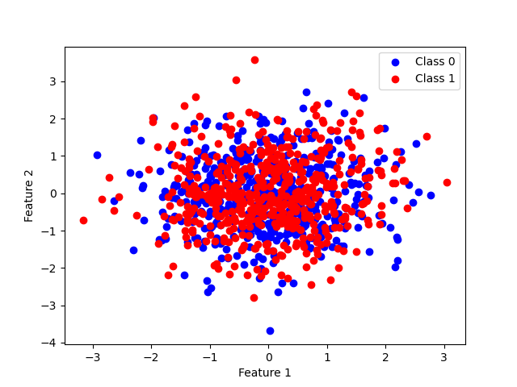
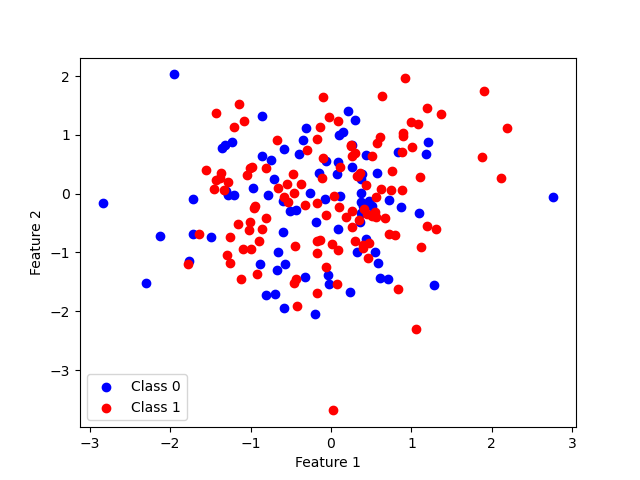

# Project

## UBC Key Capabilities in Data Science The Data Science Toolbox 

</img>
</img>

### Assignment 6

#### Module 6: File Names, Project Organization, Virtual Environments
An overview of how to effectively manage files, projects, and virtual environments.

